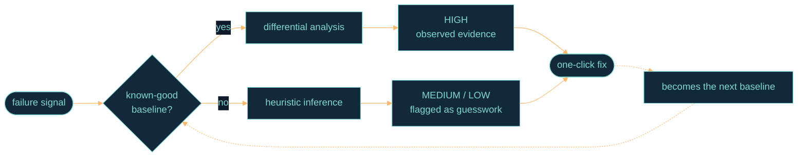

<!--
  ─────────────────────────────────────────────────────────────
  tkwind — profile README
  Colors: ink #0D1B2A · haze #1B3A4B · gust #7FD8D2 · ember #FFB86B
  Every image is served from this repo — no third-party services.
  Hand-written animated SVGs live in assets/ (tagline phrases are
  inside the header SVGs — edit BOTH). Stat + repo cards are
  rendered by scripts/render_cards.py via workflows/cards.yml.

  TODO(tkwind) — real facts to drop in when confirmed (never invent):
    · PyPI monthly downloads for repoclean-cli (flagship line below,
      and see the TODO in scripts/render_cards.py)
    · count of token formats repoclean detects (flagship line)
    · verbatim `repoclean scan` output (assets/terminal.svg)
    · LinkedIn badge in the row below, same pill style as the others
  ─────────────────────────────────────────────────────────────
-->

<picture>
  <source media="(prefers-color-scheme: dark)"  srcset="./assets/header-dark.svg">
  <source media="(prefers-color-scheme: light)" srcset="./assets/header-light.svg">
  
</picture>

<div align="center">

<a href="https://pypi.org/project/repoclean-cli/"></a>&nbsp;
<a href="https://tkwind.github.io/PostSense/"></a>&nbsp;
<a href="mailto:trishirkumarvind@gmail.com"></a>

</div>

<br>

Most tools tell you *what* happened. Mine tell you *why* — and admit it when they're guessing.

<div align="center">

</div>

```toml
[tkwind]
now      = "building developer tools that explain themselves"
ask_me   = ["CLI design", "auditable LLM agents", "why your API returns 405"]
weekends = "tuning a 3D printer — and the slicer fork it demanded"
```


## Work

<div align="center">

<a href="https://github.com/tkwind/repoclean">
  <picture>
    <source media="(prefers-color-scheme: dark)"  srcset="./generated/repo-repoclean-dark.svg">
    <source media="(prefers-color-scheme: light)" srcset="./generated/repo-repoclean-light.svg">
    
  </picture>
</a>
<a href="https://github.com/tkwind/PostSense">
  <picture>
    <source media="(prefers-color-scheme: dark)"  srcset="./generated/repo-PostSense-dark.svg">
    <source media="(prefers-color-scheme: light)" srcset="./generated/repo-PostSense-light.svg">
    
  </picture>
</a>
<a href="https://github.com/tkwind/Apply_AI">
  <picture>
    <source media="(prefers-color-scheme: dark)"  srcset="./generated/repo-Apply_AI-dark.svg">
    <source media="(prefers-color-scheme: light)" srcset="./generated/repo-Apply_AI-light.svg">
    
  </picture>
</a>
<a href="https://github.com/tkwind/ai-outreach-assistant">
  <picture>
    <source media="(prefers-color-scheme: dark)"  srcset="./generated/repo-ai-outreach-assistant-dark.svg">
    <source media="(prefers-color-scheme: light)" srcset="./generated/repo-ai-outreach-assistant-light.svg">
    
  </picture>
</a>

</div>

**⚑ Flagship — [repoclean](https://github.com/tkwind/repoclean)** · `pip install repoclean-cli` — a pre-commit gatekeeper that pairs regex token detection with entropy scoring, blocks the leak in strict mode, and emits JSON for CI.
<!-- TODO(tkwind): append real numbers here when confirmed — "N token formats · M downloads/month" -->

- **[PostSense](https://tkwind.github.io/PostSense/)** — diffs a failing request against your last working one, and simulates the browser CORS constraints your desktop client hides; every diagnosis carries an evidence grade.
- **[Apply\_AI](https://apply-ai-iota.vercel.app/)** — React Query + JWT auth over an Express/Mongo backend, with NVIDIA NIM parsing job descriptions into resume suggestions.
- **[ai-outreach-assistant](https://github.com/tkwind/ai-outreach-assistant)** — scoring, messaging, and orchestration kept deliberately separate so every decision is auditable; runs on local Mistral, so lead data never leaves the machine.

<details>
<summary><b>How each one works under the hood →</b></summary>
<br>

**[repoclean](https://github.com/tkwind/repoclean)** &nbsp;·&nbsp; A git hygiene scanner that installs itself as a pre-commit gatekeeper. It catches GitHub, Slack, Stripe, Telegram, AWS, and OpenAI tokens plus high-entropy assignments, and strict mode blocks the commit outright. JSON output plugs into CI. The premise: most leaks are speed, not carelessness — so hygiene has to be automatic.

**[PostSense](https://tkwind.github.io/PostSense/)** &nbsp;·&nbsp; An API client that debugs instead of reporting. It compares a failing request to your last successful one for the same endpoint and returns a diff, not a status code. It also auto-probes unknown endpoints in a rate-limit-safe sequence and simulates browser CORS constraints. Every diagnosis is graded High / Medium / Low, so you always know inference from knowledge. Single folder, vanilla JS, no install.

**[Apply\_AI](https://apply-ai-iota.vercel.app/)** &nbsp;·&nbsp; A job application tracker with a drag-and-drop board. NVIDIA NIM parses job descriptions into resume suggestions. React + TS + Vite on the front, Express + Mongo behind JWT auth, React Query holding the two together.

**[ai-outreach-assistant](https://github.com/tkwind/ai-outreach-assistant)** &nbsp;·&nbsp; Agentic B2B lead scoring built as three deliberately separate pieces: a scoring agent, a messaging agent, and an orchestrator. Decisions stay apart from execution, thresholds stay configurable, and every call leaves an explainable trace. It runs entirely on local Mistral via Ollama — no lead data leaves the machine.

</details>

<details>
<summary><b>The workbench — smaller repos, kept public anyway →</b></summary>
<br>

Not everything in an account is a product:

- **[jatayu-fastapi-crud](https://github.com/tkwind/jatayu-fastapi-crud)** — FastAPI + Firestore task API, Dockerized for Cloud Run, with Firestore access isolated in a service layer and a folder structure deliberately kept readable for people learning the stack.
- **[pharmazephyr-backend](https://github.com/tkwind/pharmazephyr-backend)** — Node service, in progress.
- **[OrcaSlicer-bambulab](https://github.com/tkwind/OrcaSlicer-bambulab)** — the slicer fork my printer demanded.

</details>

## How my tools think

The same decision loop ships in all three tools:



<sub>differential analysis → PostSense's request diff &nbsp;·&nbsp; heuristic inference → repoclean's entropy scoring &nbsp;·&nbsp; the explainable trace → ai-outreach-assistant's audit trail</sub>


## Stack

<div align="center">

<picture>
  <source media="(prefers-color-scheme: dark)"  srcset="./assets/stack-dark.svg">
  <source media="(prefers-color-scheme: light)" srcset="./assets/stack-light.svg">
  
</picture>

</div>

<details>
<summary><b>Every tool above, mapped to the repo it ships in →</b></summary>
<br>

| Layer | Tools | Seen in |
| :-- | :-- | :-- |
| **CLI / tooling** | Python, Click-style CLIs, entropy + regex scanning, pre-commit hooks | `repoclean` |
| **Frontend** | React, TypeScript, Vite, Tailwind — and vanilla JS when a build step would be a lie | `Apply_AI`, `PostSense` |
| **Backend** | FastAPI, Node + Express, JWT auth, layered service/controller split | `jatayu-fastapi-crud`, `Apply_AI` |
| **Data** | MongoDB + Mongoose, Firestore, Pandas | `Apply_AI`, `jatayu`, `ai-outreach-assistant` |
| **AI** | NVIDIA NIM, Ollama + Mistral running locally, agent/orchestrator separation | `Apply_AI`, `ai-outreach-assistant` |
| **Ship** | Docker, Cloud Run, Vercel, Railway, GitHub Actions, PyPI | all of it |

</details>


## The numbers

<div align="center">

<picture>
  <source media="(prefers-color-scheme: dark)"  srcset="./generated/dashboard-dark.svg">
  <source media="(prefers-color-scheme: light)" srcset="./generated/dashboard-light.svg">
  
</picture>

<sub>rendered in-repo by <a href="./scripts/render_cards.py">scripts/render_cards.py</a> from live GitHub API data — no third-party stat services anywhere on this page</sub>

<br><br>

<!-- Generated by .github/workflows/snake.yml → pushed to the `output` branch -->
<picture>
  <source media="(prefers-color-scheme: dark)"  srcset="https://raw.githubusercontent.com/tkwind/tkwind/output/snake-dark.svg">
  <source media="(prefers-color-scheme: light)" srcset="https://raw.githubusercontent.com/tkwind/tkwind/output/snake-light.svg">
  
</picture>

</div>

<details>
<summary><b>Same contributions, in 3D →</b></summary>
<br>
<div align="center">
<!-- Generated by .github/workflows/3d-contrib.yml -->

</div>
</details>

<details>
<summary><b>How this page renders itself — every pixel is in this repo →</b></summary>
<br>

No stat-card services, no rate limits, nothing that breaks at busy hours.

- The header (ASCII sweep + typing tagline), terminal, stack grid, badges, and divider are **hand-written animated SVGs** in [`assets/`](./assets) — CSS keyframes inside the files. GitHub renders them through its image proxy, so the animations run but scripts never do.
- The stat dashboard and repo cards are rendered by [`scripts/render_cards.py`](./scripts/render_cards.py) from live GitHub API data.

| Workflow | What it does | Schedule |
| :-- | :-- | :-- |
| [`cards.yml`](./.github/workflows/cards.yml) | Renders the stat dashboard + repo cards | every 6h |
| [`snake.yml`](./.github/workflows/snake.yml) | Renders the contribution snake to the `output` branch | every 12h |
| [`3d-contrib.yml`](./.github/workflows/3d-contrib.yml) | Renders the 3D contribution calendar | daily |

Theme switching uses `<picture>` + `prefers-color-scheme`, so every graphic ships in a dark and a light version.

</details>


<div align="center">

<sub><b>tkwind</b> · <a href="https://pypi.org/project/repoclean-cli/">repoclean-cli</a> · <a href="https://tkwind.github.io/PostSense/">PostSense</a> · <a href="https://github.com/tkwind?tab=repositories">all repos</a></sub>
<br>
<sub>If one of these saved you an hour, a star is a nice way to say so.</sub>

</div>
