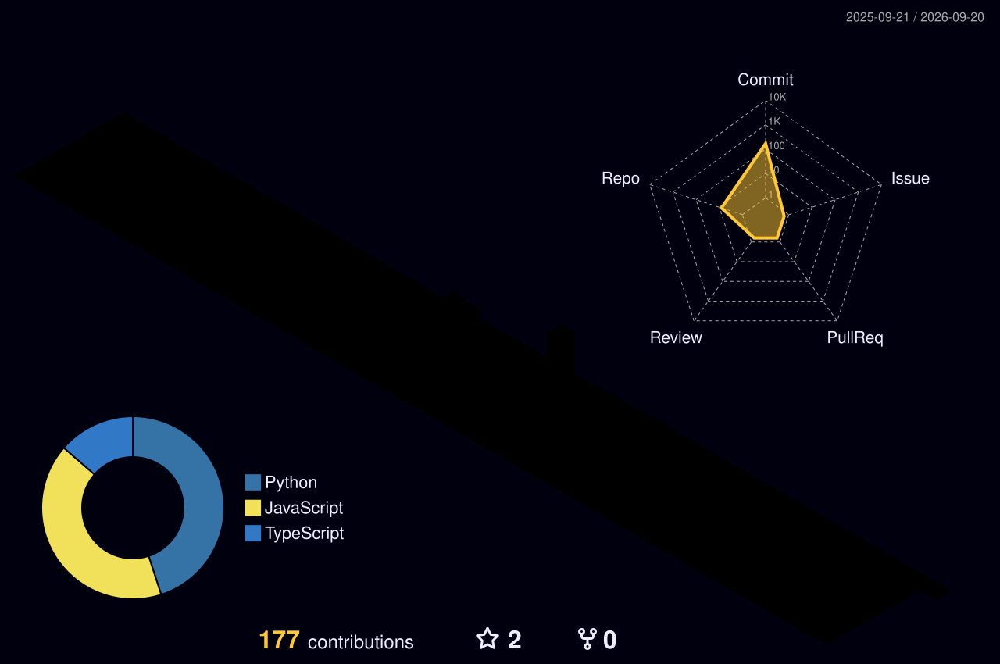

<!--
  ─────────────────────────────────────────────────────────────
  tkwind — profile README
  Colors: ink #0D1B2A · haze #1B3A4B · gust #7FD8D2 · ember #FFB86B
  Header + terminal art live in assets/ — hand-written animated SVGs.
  Edit the header subtitle in BOTH header svg files.
  ─────────────────────────────────────────────────────────────
-->

<picture>
  <source media="(prefers-color-scheme: dark)"  srcset="./assets/header-dark.svg">
  <source media="(prefers-color-scheme: light)" srcset="./assets/header-light.svg">
  
</picture>

<p align="center">
  <picture>
    <source media="(prefers-color-scheme: dark)"  srcset="https://readme-typing-svg.demolab.com/?font=Fira+Code&weight=500&size=20&duration=2800&pause=900&center=true&vCenter=true&width=680&height=44&color=7FD8D2&background=00000000&lines=I+build+tools+that+show+their+work;evidence+first+%E2%80%94+guesses+labeled+as+guesses;CLI+design+%C2%B7+API+debugging+%C2%B7+auditable+AI+agents;Python+%C2%B7+TypeScript+%C2%B7+FastAPI+%C2%B7+React">
    <source media="(prefers-color-scheme: light)" srcset="https://readme-typing-svg.demolab.com/?font=Fira+Code&weight=500&size=20&duration=2800&pause=900&center=true&vCenter=true&width=680&height=44&color=14807C&background=00000000&lines=I+build+tools+that+show+their+work;evidence+first+%E2%80%94+guesses+labeled+as+guesses;CLI+design+%C2%B7+API+debugging+%C2%B7+auditable+AI+agents;Python+%C2%B7+TypeScript+%C2%B7+FastAPI+%C2%B7+React">
    
  </picture>
</p>

<div align="center">

<a href="https://pypi.org/project/repoclean-cli/"></a>&nbsp;
<a href="https://tkwind.github.io/PostSense/"></a>&nbsp;
<a href="https://github.com/tkwind?tab=repositories"></a>&nbsp;
<a href="mailto:trishirkumarvind@gmail.com"></a>

<br><br>


</div>

<br>

Most tools tell you *what* happened. Mine are built to tell you *why* — and to admit it when they're guessing. That's the whole thesis: if software makes a judgement call, it owes you the evidence.

<div align="center">

</div>

```toml
[tkwind]
now         = "building developer tools that explain themselves"
core_stack  = ["Python", "TypeScript", "FastAPI", "React"]
shipped_to  = ["PyPI", "GitHub Pages", "Vercel", "Cloud Run"]
conviction  = "a tool that guesses should say it's guessing"
ask_me      = ["CLI design", "auditable LLM agents", "why your API returns 405"]
```


## Stack

<div align="center">

<a href="https://github.com/tkwind?tab=repositories">
  <picture>
    <source media="(prefers-color-scheme: dark)"  srcset="https://skillicons.dev/icons?i=py,ts,js,cpp,react,vite,tailwind,nodejs,express,fastapi,mongodb,firebase,docker,gcp,githubactions,vercel&perline=8&theme=dark">
    <source media="(prefers-color-scheme: light)" srcset="https://skillicons.dev/icons?i=py,ts,js,cpp,react,vite,tailwind,nodejs,express,fastapi,mongodb,firebase,docker,gcp,githubactions,vercel&perline=8&theme=light">
    
  </picture>
</a>

<br><br>


</div>

<details>
<summary><b>Where each of these actually gets used</b></summary>
<br>

| Layer | Tools | Seen in |
| :-- | :-- | :-- |
| **CLI / tooling** | Python, Click-style CLIs, entropy + regex scanning, pre-commit hooks | `repoclean` |
| **Frontend** | React, TypeScript, Vite, Tailwind — and vanilla JS when a build step would be a lie | `Apply_AI`, `PostSense` |
| **Backend** | FastAPI, Node + Express, JWT auth, layered service/controller split | `jatayu-fastapi-crud`, `Apply_AI` |
| **Data** | MongoDB + Mongoose, Firestore, Pandas | `Apply_AI`, `jatayu`, `ai-outreach-assistant` |
| **AI** | NVIDIA NIM, Ollama + Mistral running locally, agent/orchestrator separation | `Apply_AI`, `ai-outreach-assistant` |
| **Ship** | Docker, Cloud Run, Vercel, Railway, GitHub Actions, PyPI | all of it |

</details>


## Work

<div align="center">

<a href="https://github.com/tkwind/repoclean">
  
</a>
<a href="https://github.com/tkwind/PostSense">
  
</a>
<a href="https://github.com/tkwind/Apply_AI">
  
</a>
<a href="https://github.com/tkwind/ai-outreach-assistant">
  
</a>

</div>

- **[repoclean](https://github.com/tkwind/repoclean)** — `pip install repoclean-cli` · blocks the secret *before* it's committed, and grades your repo while it's at it
- **[PostSense](https://tkwind.github.io/PostSense/)** — API client that diffs a failing request against your last working one, then rates its own diagnosis
- **[Apply\_AI](https://apply-ai-iota.vercel.app/)** — drag-and-drop job tracker where NVIDIA NIM turns job descriptions into resume suggestions
- **[ai-outreach-assistant](https://github.com/tkwind/ai-outreach-assistant)** — lead-scoring agents with an audit trail, running entirely on local Mistral

<details>
<summary><b>The longer version</b></summary>
<br>

**[repoclean](https://github.com/tkwind/repoclean)** &nbsp;·&nbsp; Git hygiene scanner and secrets detector that installs itself as a pre-commit gatekeeper. Catches GitHub, Slack, Stripe, Telegram, AWS, and OpenAI tokens plus high-entropy assignments, then blocks the commit in strict mode. JSON output for CI. Most leaks aren't carelessness — they're speed, so this makes hygiene automatic instead of manual.

**[PostSense](https://tkwind.github.io/PostSense/)** &nbsp;·&nbsp; API client that debugs instead of just reporting. It compares a failing request to your last successful one for the same endpoint and returns a diff, not a status code. Auto-probes unknown endpoints in a rate-limit-safe sequence, simulates browser CORS constraints your desktop client hides, and grades every diagnosis High / Medium / Low so you know when it's inferring rather than knowing. Single folder, vanilla JS, no install.

**[Apply\_AI](https://apply-ai-iota.vercel.app/)** &nbsp;·&nbsp; Job application tracker with a drag-and-drop board, JWT auth, and NVIDIA NIM parsing job descriptions into resume suggestions. React + TS + Vite front, Express + Mongo back, React Query holding it together.

**[ai-outreach-assistant](https://github.com/tkwind/ai-outreach-assistant)** &nbsp;·&nbsp; Agentic B2B lead scoring where a scoring agent, a messaging agent, and an orchestrator stay separate on purpose — decision apart from execution, thresholds configurable, every call leaving an explainable trace. Runs entirely on local Mistral via Ollama, so no lead data leaves the machine.

</details>

<details>
<summary><b>Also in here</b></summary>
<br>

Not everything in an account is a product. These are working repos, kept public because there's no reason not to:

- **[jatayu-fastapi-crud](https://github.com/tkwind/jatayu-fastapi-crud)** — FastAPI + Firestore task API, Dockerized for Cloud Run, with Firestore access isolated in a service layer and a folder structure deliberately kept readable for people learning the stack.
- **[pharmazephyr-backend](https://github.com/tkwind/pharmazephyr-backend)** — Node service, in progress.
- **[OrcaSlicer-bambulab](https://github.com/tkwind/OrcaSlicer-bambulab)** — a slicer fork I keep around for my printer.

</details>

## How my tools think

Every judgement call follows the same shape — evidence first, and an honest label when there isn't any.


## The numbers

<div align="center">

<picture>
  <source media="(prefers-color-scheme: dark)"  srcset="https://github-readme-stats.vercel.app/api?username=tkwind&show_icons=true&hide_border=true&include_all_commits=true&rank_icon=github&bg_color=00000000&title_color=7FD8D2&text_color=9FB3C8&icon_color=FFB86B&ring_color=7FD8D2">
  <source media="(prefers-color-scheme: light)" srcset="https://github-readme-stats.vercel.app/api?username=tkwind&show_icons=true&hide_border=true&include_all_commits=true&rank_icon=github&bg_color=00000000&title_color=14807C&text_color=4A5B6B&icon_color=C86A1E&ring_color=14807C">
  
</picture>
<picture>
  <source media="(prefers-color-scheme: dark)"  srcset="https://github-readme-stats.vercel.app/api/top-langs/?username=tkwind&layout=compact&langs_count=8&hide_border=true&bg_color=00000000&title_color=7FD8D2&text_color=9FB3C8">
  <source media="(prefers-color-scheme: light)" srcset="https://github-readme-stats.vercel.app/api/top-langs/?username=tkwind&layout=compact&langs_count=8&hide_border=true&bg_color=00000000&title_color=14807C&text_color=4A5B6B">
  
</picture>

<br>

<picture>
  <source media="(prefers-color-scheme: dark)"  srcset="https://streak-stats.demolab.com?user=tkwind&hide_border=true&background=00000000&stroke=1B3A4B&ring=7FD8D2&fire=FFB86B&currStreakLabel=7FD8D2&sideLabels=9FB3C8&dates=6B7C8F&currStreakNum=EDF2F4&sideNums=EDF2F4">
  <source media="(prefers-color-scheme: light)" srcset="https://streak-stats.demolab.com?user=tkwind&hide_border=true&background=00000000&stroke=CBD9DD&ring=14807C&fire=C86A1E&currStreakLabel=14807C&sideLabels=4A5B6B&dates=8494A3&currStreakNum=0D1B2A&sideNums=0D1B2A">
  
</picture>

<br><br>


<br>

<!-- Generated by .github/workflows/snake.yml → pushed to the `output` branch -->
<picture>
  <source media="(prefers-color-scheme: dark)"  srcset="https://raw.githubusercontent.com/tkwind/tkwind/output/snake-dark.svg">
  <source media="(prefers-color-scheme: light)" srcset="https://raw.githubusercontent.com/tkwind/tkwind/output/snake-light.svg">
  
</picture>

</div>

<details>
<summary><b>Same contributions, in 3D</b></summary>
<br>
<div align="center">
<!-- Generated by .github/workflows/3d-contrib.yml -->

</div>
</details>

<details>
<summary><b>How this README works</b></summary>
<br>

The header and the terminal are hand-written animated SVGs in [`assets/`](./assets) — CSS keyframes inside the files, no external banner service. GitHub renders them through its image proxy, so the animations run but scripts never do.

Two workflows keep the rest current:

| Workflow | What it does | Schedule |
| :-- | :-- | :-- |
| [`snake.yml`](./.github/workflows/snake.yml) | Renders the contribution snake to the `output` branch | every 12h |
| [`3d-contrib.yml`](./.github/workflows/3d-contrib.yml) | Renders the 3D contribution calendar | daily |

Theme switching uses `<picture>` + `prefers-color-scheme`, so every graphic ships in a dark and a light version.

</details>


<div align="center">

<sub><b>tkwind</b> · <a href="https://pypi.org/project/repoclean-cli/">repoclean-cli</a> · <a href="https://tkwind.github.io/PostSense/">PostSense</a> · <a href="https://github.com/tkwind?tab=repositories">all repos</a></sub>
<br>
<sub>If one of these saved you an hour, a star is a nice way to say so.</sub>

</div>
